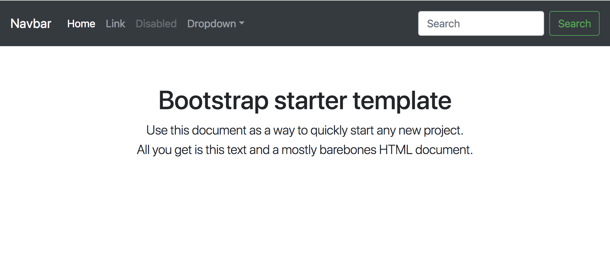

# create-bootstrap-react-app

Create React apps with Bootstrap 4.

This tool runs [Create React App](https://github.com/facebook/create-react-app) with [Bootstrap 4 React](https://github.com/richardzcode/bootstrap-4-react).

## Installation

Make sure `create-react-app` is installed.

```
npm install --global create-react-app
```

Then,

```
npm install --global create-bootstrap-react-app
```

## Create an App

```
create-bootstrap-react-app my-app
cd my-app
npm start
```



## Templates

You may create app with Bootstrap templates.

```
create-bootstrap-react-app --template <template_name> my-app
```

For a list of avaiable templates, run
```
create-bootstrap-react-app --template
```
